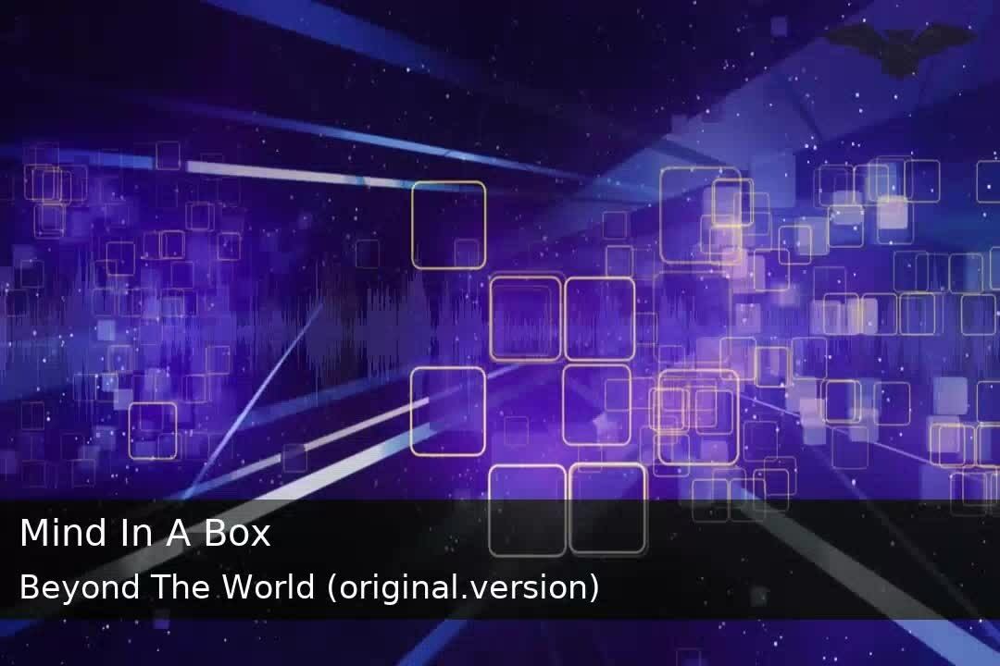

# Radio + Video = Vadeo

People like video streams, but that doesn't mean your internet radio station has to be ignored.  Stream your shoutcast-compatible internet radio station as a live video stream and reach a whole new audience.

    

        
    

## What it does

It will use your internet radio station to create a live video stream broadcast via RTMP to any live streaming platform such as [Owncast](https://owncast.online).  It will generate a 720p video stream with the now playing metadata (as provided by your radio stream), your logo, a background video loop, and an audio visualizer.
## What you need

1. An internet radio station that is [Shoutcast](https://shoutcast.com)/[Icecast](https://icecast.org/) compatible.
1. A logo to display.
1. A background video you want to loop.
1. `ffmpeg` to be [installed](https://ffmpeg.org/download.html) on your system.

## Install

1. Visit the releases page to download a version for your platform.
1. `tar xvf vadeo_vx.x.x-version.tar.gz`
1. `./vadeo`
## Setup

1. Copy your logo to `logo.png`.  Resize it and add transparency as needed.
1. Copy your background video to `background.mp4`.

## Edit `config.yaml`.

1. Find the audio stream URL to your internet radio station.  Not the web page url, the actual audio stream.  Set it in the config as `audioUrl`.
1. Put the RTMP video streaming endpoint as `streamingURL` and your stream key as `streamingKey`.

## Testing

If you just want to try it out with your station, [Owncast](https://owncast.online) provides a free testing server you can use to try out Vadeo.  Visit https://broadcast.owncast.online to get the stream key and you can point Vadeo at it to see it in action.  After testing you can [install your own server](https://owncast.online/quickstart) and expose your station to more people.

## Optional Owncast support

If you are using Vadeo with Owncast you can take advantage of the feature of your track metadata populating the Owncast web interface.

1. Make sure your Owncast server is v0.0.6 or higher.
1. In the Owncast admin go to the Integrations/Access Tokens screen.
1. Create a new [access token](https://owncast.online/thirdparty/apis/) with administrative access.
1. Edit your Vadeo configure file and paste in your Owncast and access token as `owncastAccessToken`.

Visit [Owncast's Documentation](https://owncast.online/docs) for additional information.

## Notes

* This operates as a live stream just like if you were streaming from OBS, Streamlabs, vMix, etc.  It will require enough hardware to generate this video and enough bandwidth to stream it to your live streaming provider.  If your machine or internet connection can't handle streaming via other methods, it's unlikely you'll be able to stream with this one.

* You may want to run utility on a machine separate from your actual streaming server as you may run into hardware utilization limits with two video processing applications running at once.  But you can run it anywhere, including a machine on your personal home internet.

* If you would like to stream to multiple livestreaming destinations at once, take a look at [Prism](https://github.com/muesli/prism).

* **Disclaimer:** This is a utility for convenience, experimenting and entertainment.  It was thrown together quickly and is likely not production-grade.  Improvements are welcomed, but feature requests are not likely to be implemented. 